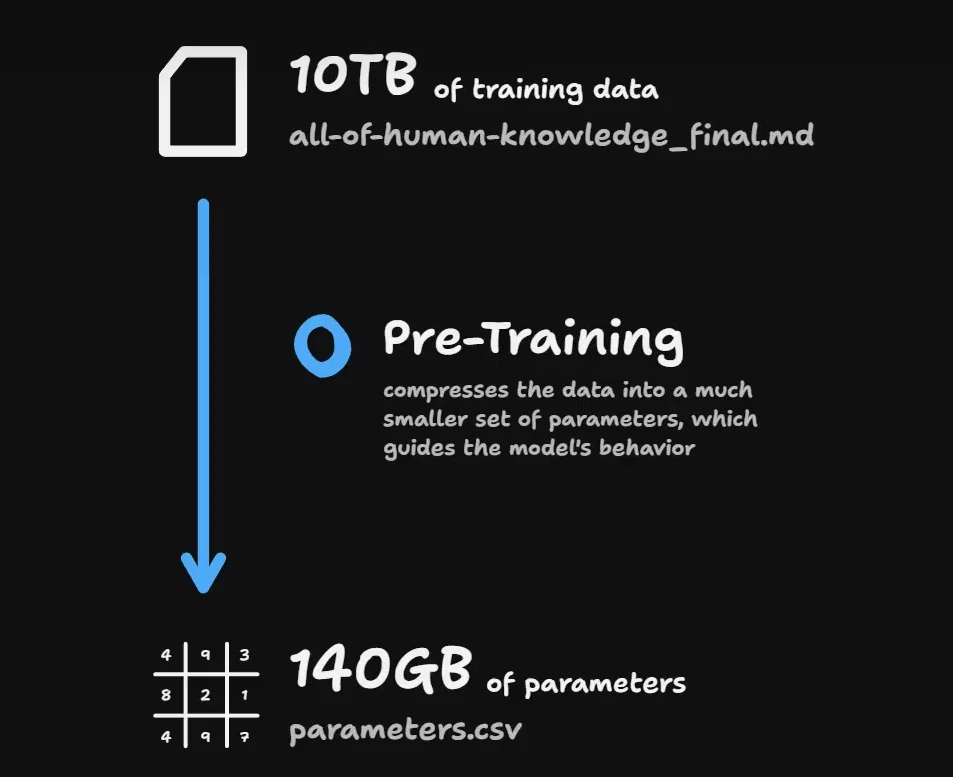
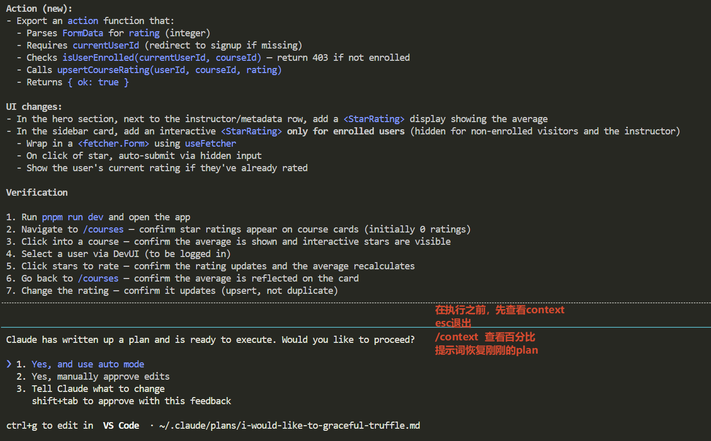

# 命令

/usage
/model
/context
/clear


# 选择文件

`@`

# 快捷键

两次ctrl+c,快速退出，一次清除输入的提示词


## 对话恢复

- 粗力度： 
    - /resume 恢复历史对话
    - claude --continue
- 细粒度： 两次esc 进入到rewind  （时光回退）能够恢复之前修改的代码


# Bash命令

`! pnpm run dev` `ctrl+b`可以将它挂起，在底部可以看到运行的bash.通过电脑方向键↓可以看到shell的运行情况。这里运行的结果，**claude code是可以看到的**,出现问题的时候，在dev下可以很方便将控制台信息交给claude code.

不让claude code看到是`ctrl+z` suspend claude code, 输入`fg`恢复对话

## 权限命令

`settings.local.json`里面记录了在与claude code运行执行的命令。这可以是在对话过程中claude code动态生成的，也可以是自己手动编辑。

```json
{
  "permissions": {
    "allow": [
      "Bash(npx react-router *)",
      "Bash(npx tsc *)",
      "Bash(pnpm *)",
      "WebSearch"
    ],
    "deny": [
      "Bash(git push *)"
    ]
  }
}
```

# Context Windows

管理模型在代码库中积累的领域知识，这意味着文档和代码库质量和组织变得十分重要。

## 预警范围

建议在40%的时候就要开始警惕了，现在社区普遍认同有智能区和降智区，只不过这个数值区间大家各有各的说法。


> 大模型不是“记住”所有训练数据，而是通过预训练，从 10TB 文本中提取出规律、结构和知识，最终浓缩成 140GB 的模型参数。这个参数集合就是模型智能的“载体”。



- 140GB 的参数（“parameters.csv”）——代表模型在预训练中学到的压缩后的知识表示。这比原始数据小得多。
- 预训练的过程，就是把海量数据压缩成一组小得多的参数，这些参数之后会指导模型的行为（比如生成文本、回答问题等）


## Claude Code上下文管理的策略

将任务委派给子agent,这是一个全新的context window,子agent在这个窗口中完成任务，然后返回这个窗口的摘要给主agent,让主agent保持对我们代码库的领域知识。

> Sub-agents operate as a context-saving mechanism and they contribute back to the parent context.


这是Claude Code实施的**为了从上下文窗口中获取更多价值**的策略。
子agent是主agent(orchestrator agent协调者)的上下文保持机制。


# 探索explore

先让模型explore我们的代码库

> Tell me what the tech stack of this coderepo and what its intended purpose is  


> **Explore** how PPP (Purchasing Power Parity) work in this repo?
请你去看看这个代码仓库中，关于购买力平价（PPP）的逻辑/实现方式是什么样的。

# 新增功能

1. 先使用plan mode进行规划。
2. esc退出 plan
3. /context 查看上下文
4. 恢复提示词

> Give me the chance to review the plan again





# ccstatusline UI配置

[ccstatusline](https://github.com/sirmalloc/ccstatusline) 


# 用到的提示词

fetch info about react-route typegen from the web

Tell me what the tech stack of this coderepo and what its intended purpose is  