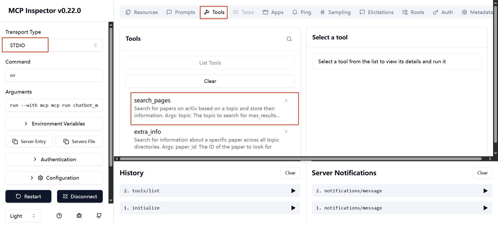
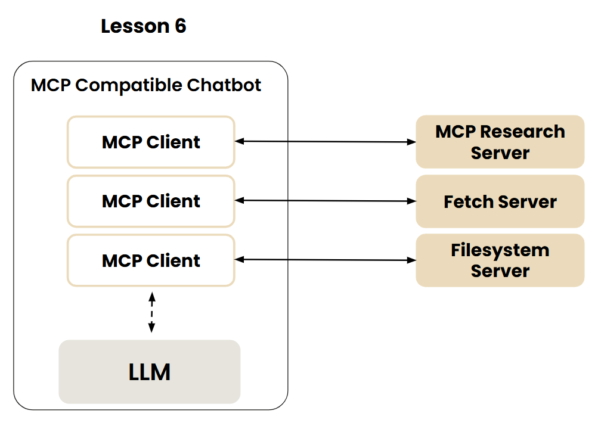

# Course Info

[Mcp Build Rich Context Ai Apps With Anthropic](https://learn.deeplearning.ai/courses/mcp-build-rich-context-ai-apps-with-anthropic)


# 工具调用的基本原理

[01-function-calls](./01-function-calls)

告诉模型，该agentic应用提供了哪些工具。当模型需要调用工具的时候，会返回一条消息，要调用工具的名称和参数。

告诉模型有哪些工具tool_schema, 这里是OpenAI的格式，DeepSeek兼容这个格式，而Anthropic的格式稍微不一样。
[DeepSeek的tool_calls](https://api-docs.deepseek.com/zh-cn/guides/tool_calls)
```python
tools = [
    {
        "type": "function",
        "function": {
            "name": "get_weather",
            "description": "Get weather of a location, the user should supply a location first.",
            "parameters": {
                "type": "object",
                "properties": {
                    "location": {
                        "type": "string",
                        "description": "The city and state, e.g. San Francisco, CA",
                    }
                },
                "required": ["location"]
            },
        }
    },
]
```

模型返回的数据大概长这样:
```json
{
  "arguments": {
    "topic": "Large Language Models",
    "max_results": 10
  },
  "name":"search_pages"
}
```
接收到模型的消息之后，我们进行解析，并调用对应的工具。
一个字典，key是工具名称，value是工具函数。
```python
mapping_tool_function = {
    "search_pages": search_pages,
    "extra_info": extra_info,
}
```

调用具体的工具函数
```python
# agentic与LLM沟通的核心运转
while True:
    msg = invoke_llm(msgs)
    if msg.tool_calls:
        print(msg.content)
        # Keep the tool calls info that AI will invoke
        msgs.append(msg)

        # call the tool
        for tool in msg.tool_calls:
            result = execute_tool(tool.function.name, tool.function.arguments)
            msgs.append({"role": "tool", "tool_call_id": tool.id, "content": f"{result}"})

# 调用工具execute_tool
def execute_tool(tool: str,tool_args: str) -> str:
    kwargs = json.loads(tool_args)
    print(f'{"*"*3} 正在调用... {tool} 参数为{tool_args} {"*"*3} ')
    result = mapping_tool_function[tool](**kwargs)
    
    # ... 处理结果为字符串 ...
```

---

# MCP Server

[02-stdio-mcp-server](./02-stdio-mcp-server)
之前的工具都是在Agentic中定义，现在可以定义一个MCP Server，将工具单独放到MCP Server中。

```python
from mcp.server.fastmcp import FastMCP
mcp = FastMCP("mcp server name")

@mcp.tool()
def search_pages(topic: str, max_results: int = 5) -> list[str]:
    """工具描述"""
    ...
# 启动mcp server
mcp.run(transport='stdio')
```

MCP Server测试工具inspector

```shell
# uv run python chatbot_mcp_server.py
# npx @modelcontextprotocol/inspector
uv run mcp dev mcp_server_scriptxxxx.py
```


# Agentic应用(客户端)使用MCP提供的工具

[03-mcp-client](./03-mcp-client)

核心原理两步骤：
1. 像`工具调用的基本原理`一样，首先我们需要从MCP Server中获取工具列表，绑定到模型中。
2. 当模型需要调用工具时，通过与MCP Server进行通信，将工具调用信息发送给MCP Server，MCP Server会调用对应的工具，并返回结果。
3. 将结果发回到模型中，模型会处理结果。


从MCP Server中获取工具列表，处理成模型识别的schema [DeepSeek的tool_calls](https://api-docs.deepseek.com/zh-cn/guides/tool_calls)

```python
from mcp import stdio_client, ClientSession
async with stdio_client(server_params) as (read, write):
    async with ClientSession(read, write) as session:
        # 与MCP Server建立连接
        session.initialize()
        # list available tools
        response = await session.list_tools()
        # 构建tool schema
        self.available_tools = [{
            "type": "function",
            "function": {
                "name": tool.name,
                "description": tool.description,
                "parameters": tool.inputSchema
            }
        } for tool in response.tools]
```

调用MCP Server的工具

```python
msgs = ...
msg = await self.invoke_llm(msgs)
if msg.tool_calls: # 模型需要调用工具
    # Keep the tool calls info that AI will invoke
    msgs.append(msg)
    # call the tool
    for tool in msg.tool_calls:
        # 通过session调用工具
        result = await self.session.call_tool(tool.function.name, json.loads(tool.function.arguments))
        # 回填工具结果
        msgs.append({"role": "tool", "tool_call_id": tool.id, "content": f"{result}"})
```

# 接入生态其他MCP Server

[04-connect-other-mcp-server](./04-connect-other-mcp-server)

MCP生态中提供了很多[Mcp Servers](https://github.com/modelcontextprotocol/servers)，这里提供接入方式。


这里用一个json文件进行维护[server_config.json](./04-connect-other-mcp-server/server_config.json)
这里维护的都是stido进程的启动命令，以及参数。
```json
{
  "mcpServers": {
    ...
    "research": {
      "command": "uv",
      "args": [
        "run",
        "chatbot_mcp_server.py"
      ]
    },
    "fetch": {
      "command": "uvx",
      "args": [
        "mcp-server-fetch"
      ]
    }
  }
}
```

处理配置文件
```python
with open("server_config.json") as f:
    mcp_servers_config = json.load(f)

servers = mcp_servers_config.get('mcpServers', {})
for server_name, config in servers.items():
    await self.connect_to_server(server_name, config)
```


客户端启动的时候，维护好工具与MCP Server的映射关系（因为mcp client与mcp server是`1:1`的关系）


维护session
```python
# bind tool to session
self.tool_to_session: dict[str,ClientSession] = {}
# connect_to_server
self.tool_to_session[tool.name]=session
```

调用工具的时候，找到对应的session
```python
session = self.tool_to_session[tool_name]
result = await session.call_tool(tool_name, kwargs)
```