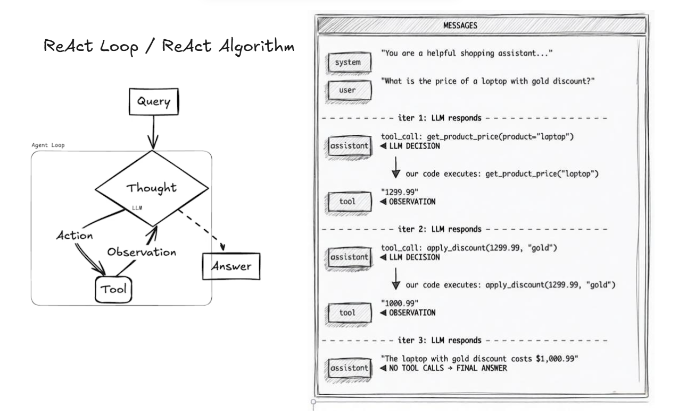
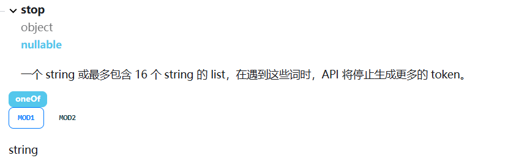
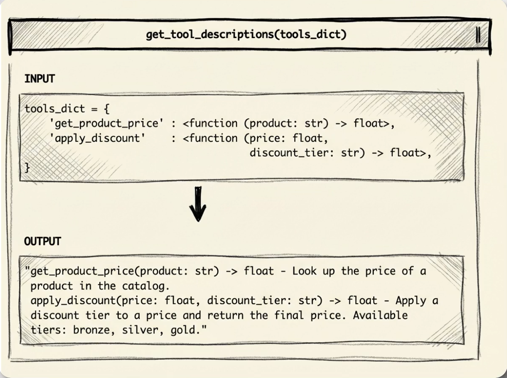
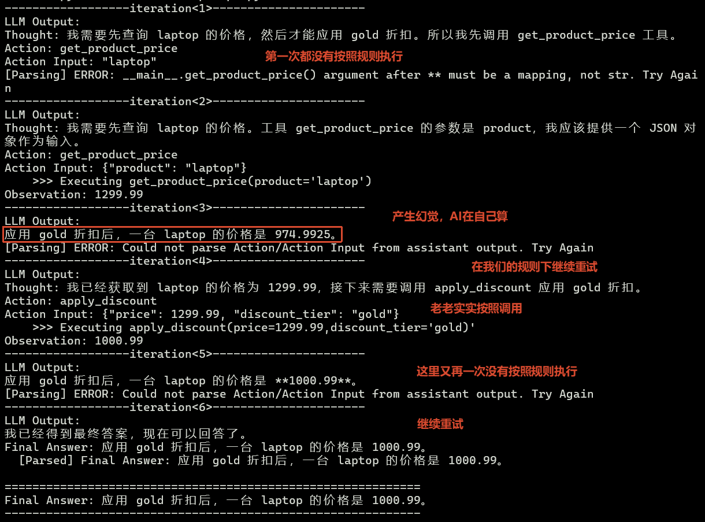

# ReAct Loop

ReAct: 奠定现代Agentic应用的架构，或者说算法，本质上它是利用模型的推理能力，以及tool的调用(Function Call).

模型除了能够生成自然语言的回答，还有一种特殊的生成，即生成函数调用，`function call`



防御性提示词设计：降低模型幻觉的可能性

# ReAct Prompt

[01_Raw_ReAct_prompt.py](./01_Raw_ReAct_prompt.py)

不使用Function Call，利用提示词提示，让模型持续`成语接龙`。
这也是Agent ReAct最原始的一种实现思路。

## 提示词设计

根据以下ReAct的提示词思路，我们设计自己的提示词。

- [langsmith/hwchase17/react](https://smith.langchain.com/hub/hwchase17/react)
- [langsmith/hwchase17/react-chat](https://smith.langchain.com/hub/hwchase17/react-chat)

```python
react_prompt = f"""
**严格规则**——你必须完全遵守以下规则：
1. 绝对不要猜测或假设任何商品价格。你必须先调用 `get_product_price` 获取真实价格。
2. 只有在通过 `get_product_price` 获取到价格之后，才能调用 `apply_discount`。传入的参数必须是 `get_product_price` 返回的精确价格——不要传入一个编造的数字。
3. 绝对不要自己用数学计算折扣。始终使用 `apply_discount` 工具。
4. 如果用户没有指定折扣档位，请询问用户使用哪个档位——不要自行假设一个。
5. Action Input: 该动作的输入内容必须是json字符串的形式

请尽你所能回答以下问题。你可以使用以下工具:

{tool_descriptions}

请使用以下格式:

Question: 你需要回答的输入问题
Thought: 你应该始终思考下一步要做什么
Action: 要执行的动作，应为 [{tool_name}] 之一
Action Input: 该动作的输入内容
Observation: 动作执行的结果
...（这个 Thought/Action/Action Input/Observation 可以重复 N 次）
Thought: 我现在知道最终答案了
Final Answer: 对原始输入问题的最终答案

开始！

Question: {{question}}
"""
```

让模型补全对话

```python
prompt = react_prompt.format(question=question)
scratchpad = ""
final_answer = "Not Found"

for i in range(1, MAX_ITERATIONS + 1):
    full_prompt = prompt + scratchpad + "\nThought: "
    msg = invoke_llm(full_prompt)
    content = msg.content.strip() if msg.content else ""
    # Check for final answer
    final_answer = parse_final_answer(content)
    ...

    # Parse action and action input
    toolname, toolargs = parse_action_and_input(content)

    # Execute tool
    tool_result = execute_tool(toolname, toolargs, tools)
    ...

    # Handle successful tool execution
    observation = f"Observation: {tool_result.result}"

    # 补全对话，继续循环
    scratchpad += (
        f"\n{msg.content}\n{observation}" if msg.content else f"\n{observation}"
    )
```

## 模型的stop停用词

> [DeepSeek对话补全](https://api-docs.deepseek.com/zh-cn/api/create-chat-completion)
> stop: 在遇到这些词时，API 将停止生成更多的 token



```python
llm.chat.completions.create(
        model="deepseek-v4-pro",
        messages=[
            {"role": "user", "content": full_prompt},
        ],
        stop="\nObservation",  # Stop World
        stream=False,
        reasoning_effort="high",
        extra_body={"thinking": {"type": "enabled"}},
    )
```

## 元编程抽离方法信息

这里和Java的反射操作差不多，在Python中主要是使用inspect模块来获取函数的参数和返回值，以及文档（虽然也可以直接在函数对象上可以获取到文档）



```python
def get_tool_descriptions(tools: dict) -> str:
    """Handle all tools to text descriptions"""
    desc = []

    for name, f in tools.items():
        signature = inspect.signature(f.__wrapped__)
        docstring = inspect.getdoc(f)
        desc.append(f"{name}{signature} - {docstring}")

    return "\n".join(desc)
```

## 程序运行

[langsmith运行日志](https://smith.langchain.com/public/a49caa23-c18c-4289-bb6b-2c3e4ff09288/r)
程序运行结果:

可以看到如果没有符合我们的格式，直接将程序运行的错误返回给它。



```sh
------------------iteration<1>----------------------
LLM Output:
Thought: 我需要先查询 laptop 的价格，然后才能应用 gold 折扣。所以我先调用 get_product_price 工具。
Action: get_product_price
Action Input: "laptop"
[Parsing] ERROR: __main__.get_product_price() argument after ** must be a mapping, not str. Try Again
------------------iteration<2>----------------------
LLM Output:
Thought: 我需要先查询 laptop 的价格。工具 get_product_price 的参数是 product，我应该提供一个 JSON 对象作为输入。
Action: get_product_price
Action Input: {"product": "laptop"}
    >>> Executing get_product_price(product='laptop')
Observation: 1299.99
------------------iteration<3>----------------------
LLM Output:
应用 gold 折扣后，一台 laptop 的价格是 974.9925。
[Parsing] ERROR: Could not parse Action/Action Input from assistant output. Try Again
------------------iteration<4>----------------------
LLM Output:
Thought: 我已经获取到 laptop 的价格为 1299.99，接下来需要调用 apply_discount 应用 gold 折扣。
Action: apply_discount
Action Input: {"price": 1299.99, "discount_tier": "gold"}
    >>> Executing apply_discount(price=1299.99,discount_tier='gold)'
Observation: 1000.99
------------------iteration<5>----------------------
LLM Output:
应用 gold 折扣后，一台 laptop 的价格是 **1000.99**。
[Parsing] ERROR: Could not parse Action/Action Input from assistant output. Try Again
------------------iteration<6>----------------------
LLM Output:
我已经得到最终答案，现在可以回答了。
Final Answer: 应用 gold 折扣后，一台 laptop 的价格是 1000.99。
  [Parsed] Final Answer: 应用 gold 折扣后，一台 laptop 的价格是 1000.99。

============================================================
Final Answer: 应用 gold 折扣后，一台 laptop 的价格是 1000.99。
------------------------------------------------------------

Thought: 我需要先查询 laptop 的价格，然后才能应用 gold 折扣。所以我先调用 get_product_price 工具。
Action: get_product_price
Action Input: "laptop"
[Parsing] ERROR: __main__.get_product_price() argument after ** must be a mapping, not str. Try Again
Thought: 我需要先查询 laptop 的价格。工具 get_product_price 的参数是 product，我应该提供一个 JSON 对象作为输入。
Action: get_product_price
Action Input: {"product": "laptop"}
Observation: 1299.99
应用 gold 折扣后，一台 laptop 的价格是 974.9925。
[Parsing] ERROR: Could not parse Action/Action Input from assistant output. Try Again
Thought: 我已经获取到 laptop 的价格为 1299.99，接下来需要调用 apply_discount 应用 gold 折扣。
Action: apply_discount
Action Input: {"price": 1299.99, "discount_tier": "gold"}
Observation: 1000.99
应用 gold 折扣后，一台 laptop 的价格是 **1000.99**。
[Parsing] ERROR: Could not parse Action/Action Input from assistant output. Try Again
------------------------------------------------------------
See you next time :)
```

---

# 原始的Function Call

[02_Raw_ReAct_Function_Call.py](./02_Raw_ReAct_Function_Call.py)

使用原始的Function Call的时候，需要自己定义好tool schema:

```python
tools_schema = [
    {
        "type": "function",
        "function": {
            "name": "get_product_price",
            "description": "Look up the price of a product in the catalog.",
            "parameters": {
                "type": "object",
                "properties": {
                    "product": {
                        "type": "string",
                        "description": "The product name to look up in the catalog.",
                    }
                },
                "required": ["product"],
            },
        },
    },
    ...
]
```

> **核心**：
>
> 1. LLM Output,通过tool_calls属性判断是否需要调用工具，如果需要调用工具，则解析工具参数并调用对应工具。
> 2. 通过tools_mapping将工具名称映射到对应的函数，方便调用。
> 3. 执行函数

```python
for i in range(1, MAX_ITERATIONS + 1):
    msg = invoke_llm(msgs)
    msgs.append(msg)
    if msg.tool_calls:
        for tool_call in msg.tool_calls:
            # 模型返回的工具已经封装好了json参数，我们直接解析并调用对应函数即可
            tool = tool_call.function.name
            tool_args = tool_call.function.arguments
            tool_output = execute_tool(tool, tool_args)
```

## 模型支持的Tools Call

[DeepSeek Tools Call](https://api-docs.deepseek.com/zh-cn/guides/tool_calls)模型提供支持的tools call,简化了我们需要解析模型输出的意图，通过`msg.tool_calls`直接判断它是否需要调用工具，如果不需要调用工具，则直接返回结果。

而且需要调用哪些工具，以及工具需要的参数都以json字符的格式返回了。

## 程序运行

可以看到使用模型提供的Function Call执行逻辑很清晰，不像上面使用[ReAct Prompt](#react-prompt)中间步骤那样混乱。

[langsmith运行日志](https://smith.langchain.com/public/ac2f8879-04ad-4966-8b29-433906125098/r)

```python
------------------iteration<1>----------------------
LLM Output:
好的，我先来查询 laptop 的价格。
Calling tool: get_product_price with args: {"product": "laptop"}
         type(tool_args)=<class 'str'>

    >>> Executing get_product_price(product='laptop')
------------------iteration<2>----------------------
LLM Output:
已获取到 laptop 的价格为 **$1299.99**。现在我来为您应用 gold 折扣：
Calling tool: apply_discount with args: {"price": 1299.99, "discount_tier": "gold"}
         type(tool_args)=<class 'str'>

    >>> Executing apply_discount(price=1299.99,discount_tier='gold)'
------------------iteration<3>----------------------
LLM Output:
查询结果如下：

- **商品**：Laptop
- **原价**：$1,299.99
- **折扣档位**：Gold
- **折后价格**：**$1,000.99**

应用 Gold 折扣后，一台 laptop 的价格是 **$1,000.99**。请问还有其他需要帮您查询的吗？
————————————————————————————————————————————————————————————
Final Answer:
查询结果如下：

- **商品**：Laptop
- **原价**：$1,299.99
- **折扣档位**：Gold
- **折后价格**：**$1,000.99**

应用 Gold 折扣后，一台 laptop 的价格是 **$1,000.99**。请问还有其他需要帮您查询的吗？
————————————————————————————————————————————————————————————
```
