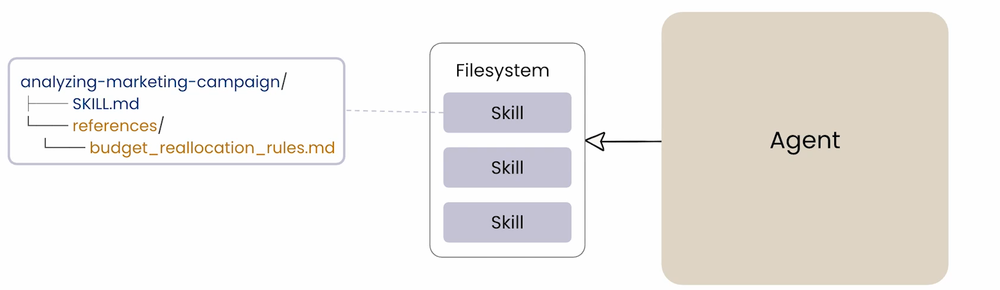
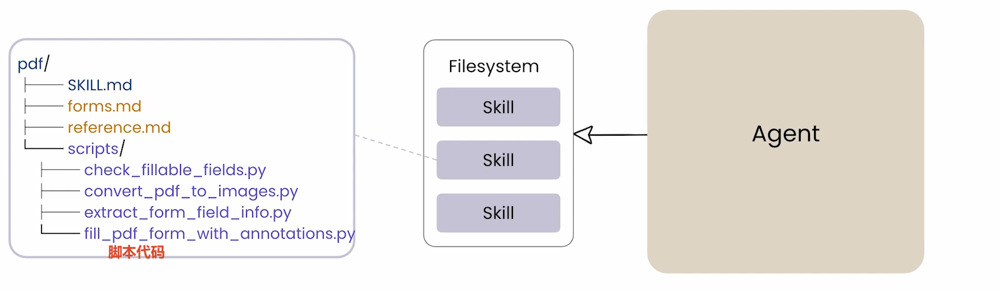
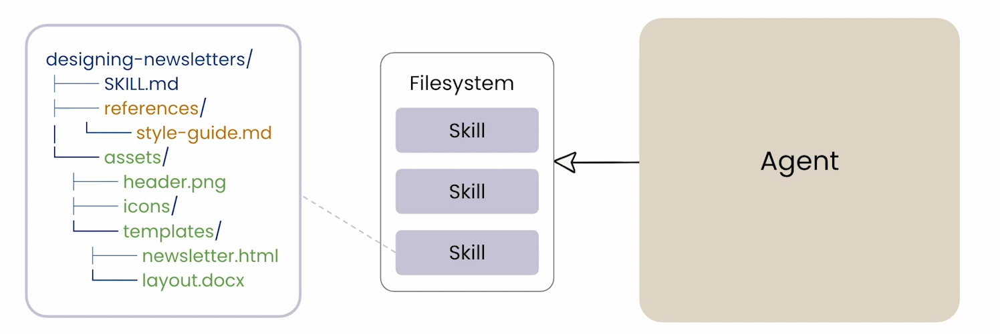
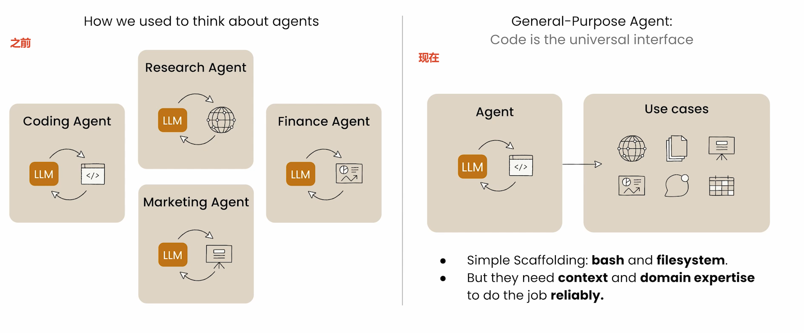

skills-compatible AI application

`Skill` = 结构化的`Prompt`体系 + 配套资源文件 + 渐进式加载机制

`Skill` 让 `Agent`(如Claude） 的"大脑"里同时装着几十个专家，每个专家只在自己被需要时才"醒来"——这叫 `"专家池"模式`。

Agent Skills 是一种轻量级、开放格式的 AI 代理能力扩展方案。(Agent Skills are a lightweight open format for extending AI agent capabilities)

| 方案                   | 重量级                                  | 轻量级 |
| ---------------------- | --------------------------------------- | ------ |
| 微调模型 (Fine-tuning) | 需要GPU、数据集、训练流程，成本数万美金 | ❌     |
| RAG（检索增强生成）    | 需要向量数据库、Embedding模型、维护索引 | ❌     |
| MCP Server             | 需要独立服务进程、网络通信、复杂配置    | ❌     |
| Agent Skill            | 只需要一个文件夹 + 一个Markdown文件     | ✅     |

A **skill** is a **folder of organized files** consisting of instructions,scripts,assets and resources that agents can discover to perform a specific task accurately.

```txt
┌─────────────────────────────────────────────────────────────┐
│                    Skill = 文件夹                           │
├─────────────────────────────────────────────────────────────┤
│  📄 SKILL.md          ← 必需：核心指令（"怎么做"）          │
│  📁 scripts/          ← 可选：可执行代码（"动手做"）        │
│  📁 assets/           ← 可选：静态素材（"用什么工具"）      │
│  📁 references/       ← 可选：参考资料（"按什么标准"）      │
│  📁 templates/        ← 可选：输出模板（"长什么样"）        │
├─────────────────────────────────────────────────────────────┤
│  发现机制：Agent 启动时扫描 → 按任务匹配 → 按需加载         │
└─────────────────────────────────────────────────────────────┘
```





Agent Skills 的本质，是把"专业知识"从 Agent 的代码中抽离出来，变成独立的、可移植的 Skill 文件。这样，一个通用 Agent 可以通过加载不同的 Skill，在不同场景下表现出"专家级"的能力。

随着我们构建了越来越多这种"单一用途 Agent"，我们开始意识到：在底层，它们真正需要的只是一个简单的**骨架**——像 **bash** 和**文件系统**这样的基础工具，用来查找、编辑、修改、执行各种任务。



`Code is the universal interface`: 只要 Agent 能执行代码（bash）和读写文件，它理论上就能完成任何数字世界里的任务。因为所有任务最终都可以归结为"运行某个程序，处理某些文件

1. under the hood, all they really need is a simple scaffolding(底层只需要一个简单骨架)
2. domain expertise(领域知识) is really where skills shine（领域专业知识是 Skill 发光的地方）

# Progressive Disclosure（渐进式披露）

让 Agent "知道很多，但只思考需要的

| 层级         | 加载状态 | Agent 的认知                            |
| :----------- | :------- | :-------------------------------------- |
| Metadata     | 始终加载 | "我拥有 50 个 Skill，分别是什么"        |
| Instructions | 按需加载 | "我正在用营销分析 Skill，具体步骤是..." |
| Resources    | 按需加载 | "用户要预算调整，我看看规则文件..."     |

> **类比**：一个顶级律师的大脑里装着几百部法律（Metadata），但开庭时只调取相关法条（Instructions），只有遇到复杂案件才去查详细判例（Resources）。

**实现"专家池"模式**

```txt
┌─────────────────────────────────────────────────────────────┐
│                    通用 Agent 的"大脑"                      │
│                                                           │
│  ┌─────────────────────────────────────────────────────┐   │
│  │ 常驻内存（Metadata 层）                            │   │
│  │ 📋 marketing-analyzer   → 分析营销数据             │   │
│  │ 📋 code-reviewer        → 审查代码                 │   │
│  │ 📋 legal-compliance     → 法律合规检查             │   │
│  │ 📋 ppt-creator          → 生成演示文稿             │   │
│  │ ... (50+ 个 Skill 的名称和描述)                    │   │
│  └─────────────────────────────────────────────────────┘   │
│                                                           │
│  用户说："帮我分析这份营销数据"                            │
│         ↓                                                │
│  Agent 查找常驻内存 → 匹配到 marketing-analyzer          │
│         ↓                                                │
│  加载 Instructions（第二步）→ 开始执行                   │
│         ↓                                                │
│  用户说："顺便做一下预算调整"                            │
│         ↓                                                │
│  加载 Resources（第三步）→ 读取预算规则文件              │
└───────
```

# 应用场景

Skill 的应用场景拆成三类，每一类代表了 Skill 在不同维度上的价值

## 1. Domain Expertise 领域专业知识——解决"不懂行"的问题

**本质**：把"老员工的经验"沉淀下来。

| 场景         | 没有 Skill 时                           | 有了 Skill 后                                    |
| ------------ | --------------------------------------- | ------------------------------------------------ |
| **品牌指南** | Claude 可能用错 Logo 颜色或字体         | Skill 里规定“主色为 #1A73E8，标题用思源黑体”     |
| **法律审核** | Claude 可能忽略关键条款                 | Skill 里写着“必须检查第 3.2 条的赔偿条款”        |
| **数据分析** | Claude 可能用平均值，但公司标准是中位数 | Skill 里指定“本公司标准：用中位数消除极端值影响” |

> 💡 关键洞察：这些知识不在任何公开的 LLM 训练数据里，它们是您公司的私域知识。Skill 就是把"您公司特有的做法"装进 Agent 的大脑。

## 2. Repeatable Workflow 可重复的工作流——解决"每次重来"的问题

**本质**：把"周报套路"自动化。

| 场景             | 没有 Skill 时          | 有了 Skill 后                                            |
| :--------------- | :--------------------- | :------------------------------------------------------- |
| **每周营销复盘** | 每周五重新写一遍提示词 | 说一句"做周报"，Skill 自动执行 15 步流程                 |
| **客户来电准备** | 每次手动搜索客户历史   | Skill 自动整合 CRM 数据、过往邮件、上次会议纪要          |
| **季度业务回顾** | 每次重新设计 PPT 结构  | Skill 固定了"QBR 三部分：数据回顾 → 问题诊断 → 下季计划" |

> 💡 **关键洞察**：这是 Skill 最直接的 ROI（投资回报率）。如果一项任务您每周/每月/每季度都要做一次，**它就是 Skill 的绝佳候选**。

## 3. New Capabilities 新能力的赋予——解决"不会做"的问题

**本质**：让 Claude 学会它原生不会的技能。

| 场景                | 没有 Skill 时                       | 有了 Skill 后                                          |
| :------------------ | :---------------------------------- | :----------------------------------------------------- |
| **创建 PPT**        | Claude 只能给文本，您手动复制到 PPT | Skill 调用 `python-pptx` 库直接生成 `.pptx` 文件       |
| **生成 Excel 报告** | Claude 只能给 CSV，您手动调格式     | Skill 调用 `openpyxl` 生成带图表、带格式的 `.xlsx`     |
| **构建 MCP 服务器** | 您自己写 Python 代码                | Skill 提供模板和脚手架，Claude 帮您生成标准 MCP Server |

> 💡 **关键洞察**：这类 Skill 本质上是在**给 Claude 装"插件"**，<span style="color: #1A73E8">让它能输出您可以直接使用的**产物**,而不只是文字</span>。

# Resource

[Deeplearn.ai: agent-skills-with-anthropic](https://learn.deeplearning.ai/courses/agent-skills-with-anthropic/lesson/ldn5c3/introduction)

[Bilibi: agent-skills-with-anthropic](https://www.bilibili.com/video/BV1qv6eBZErD/?spm_id_from=333.337.search-card.all.click&vd_source=f9745f81b4981bb1eca8c2d80be33ff9)

[Github Repo](https://github.com/https-deeplearning-ai/sc-agent-skills-files/tree/main)
